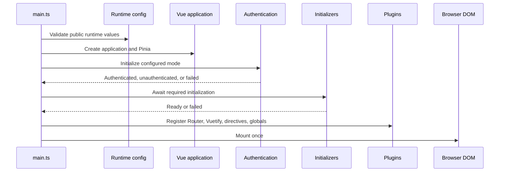

# Bootstrap Contract

The target bootstrap is an ordered infrastructure pipeline. Each asynchronous phase must settle before the next phase that depends on it starts.

Configuration failure and required initialization failure stop normal mounting and use the fatal infrastructure path. An unauthenticated result follows the authentication contract. Optional initialization may permit explicitly documented degraded operation; failures must not be swallowed.

Global initialization is distinct from page loading. Its stable lifecycle is `not-started → initializing → ready | failed`; retries, if implemented, return through `initializing`. Route guards must wait on the same real completion promise rather than invoking a no-op wait.

Business preload implementations and data contracts remain business-owned and are not changed by this architecture.
