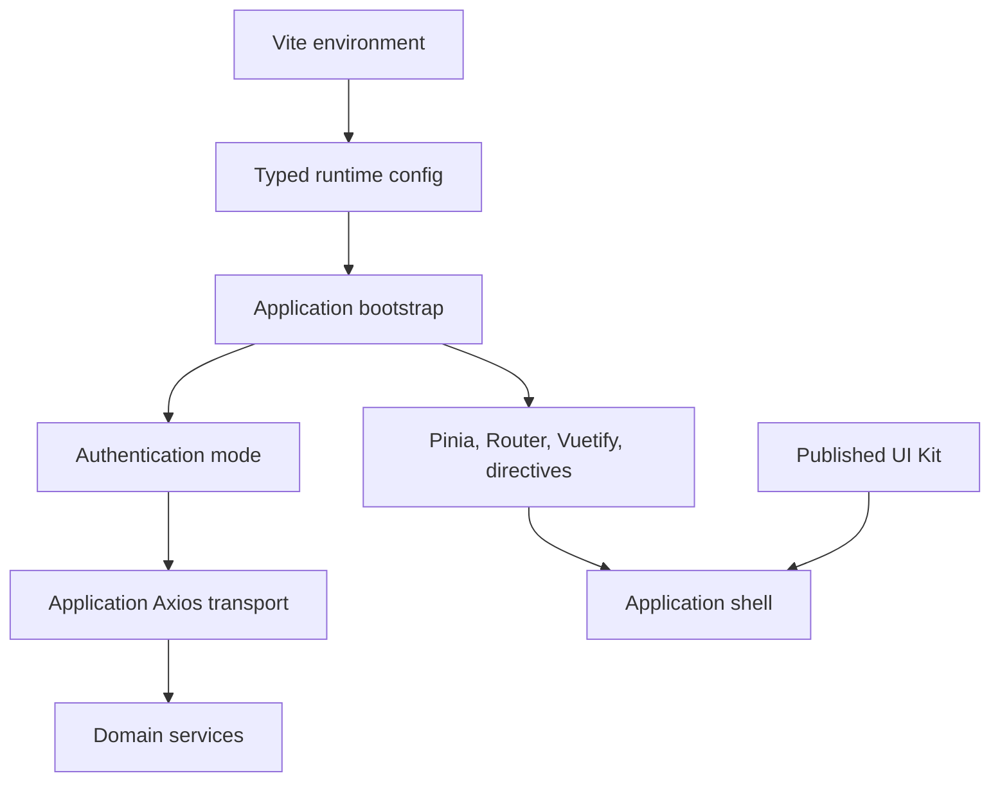

# Frontend Infrastructure

This document describes the infrastructure boundary of `vosool-frontend`. Business endpoints, DTOs, filters, permissions, workflows, and page behavior are outside this boundary.

## Ownership

The application owns Vue, Router, Pinia, Vuetify, authentication, authorization policy, runtime configuration, and its Axios transport. `@amirjalili1374/ui-kit` supplies reusable presentation components. Consume it through package-root exports and its documented CSS export; never import sibling repository source.

## Runtime configuration

`src/config/runtime.ts` is the typed boundary for new infrastructure. It validates the API URL, authentication mode, and Keycloak settings, normalizes URL formatting, rejects demo/development authentication in production, and exposes no secrets.

Supported browser variables are:

- `VITE_API_BASE_URL`
- `VITE_BASE_URL`
- `VITE_AUTH_MODE`
- `VITE_KEYCLOAK_URL`
- `VITE_KEYCLOAK_REALM`
- `VITE_KEYCLOAK_CLIENT_ID`
- `VITE_AUTH_FALLBACK_LOGIN_URL`
- `VITE_AUTH_FALLBACK_AUTHORIZATION_URL`
- `VITE_DEBUG`
- `VITE_APP_TITLE`
- `VITE_APP_ENV`
- `VITE_PORT` (development server only)

All `VITE_*` values are visible to browser users. A Keycloak public client ID is configuration; a client secret must never be stored in this repository or CI variables.

## Infrastructure contracts

- Authentication modes are `keycloak`, `jwt`, `initializer`, `dev`, and `demo`. Production must not use `dev` or `demo`.
- The consumer Axios singleton remains the canonical transport and continues to be injected into UI Kit DataTables.
- Backend authorization is mandatory. Frontend permissions control presentation only.
- Initialization exposes explicit `not-started`, `initializing`, `ready`, and `failed` states. It does not report ready before awaited work completes, and concurrent initialization calls share the same in-flight work.
- Browser history base paths come from validated application configuration.

## CI

GitLab CI installs exclusively from `package-lock.json`, then runs non-mutating lint, type checking, tests, coverage, and live/prelive builds. It retains coverage and production build artifacts temporarily. CI runtime values must be supplied as protected or project variables where appropriate; names match the environment list above.

There are no deployment, publication, tagging, or release jobs in this foundation.

## Known limitations

- `envConfig.ts` remains a compatibility wrapper around the typed runtime boundary for existing imports.
- Authentication, Router, HTTP errors, permissions, and bootstrap are implemented and described in their focused architecture documents.
- The currently consumed UI Kit version retains known DataTable request-race and remote-sorting limitations.
- Real-browser and deployment validation are not part of the current unit-test pipeline.
- No SSR support is claimed.
